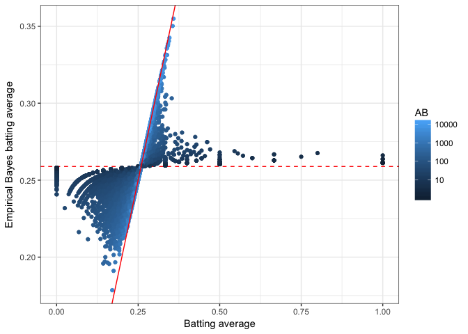
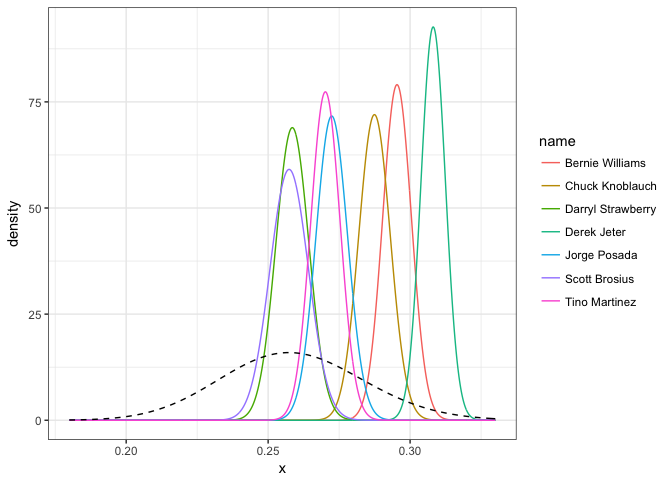
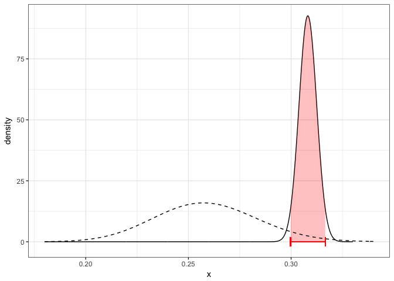
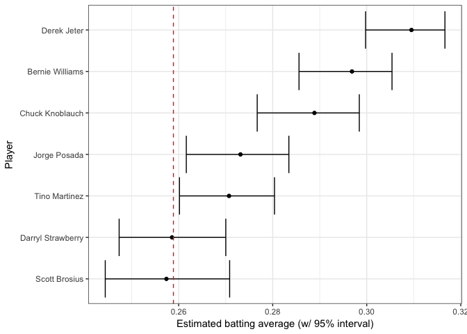

This post and the following posts are a simplification of a series of posts by [David Robinson](http://varianceexplained.org/r/credible_intervals_baseball/)


```r
library(knitr)
opts_chunk$set(cache = TRUE, warning = FALSE, message = FALSE)
options(digits = 3)
```


- Empirical Bayes used to calculate a single point value for each player, that can reliably used as an estimate
- Sometimes you want to know how much uncertainty there is in the point estimate


```r
library(ggplot2)
theme_set(theme_bw())
```

```r
library(dplyr)
library(tidyr)
library(Lahman)

career <- Batting %>%
  filter(AB > 0) %>%
  anti_join(Pitching, by = "playerID") %>%
  group_by(playerID) %>%
  summarize(H = sum(H), AB = sum(AB)) %>%
  mutate(average = H / AB)

career <- Master %>%
  tbl_df() %>%
  select(playerID, nameFirst, nameLast) %>%
  unite(name, nameFirst, nameLast, sep = " ") %>%
  inner_join(career, by = "playerID")

career_filtered <- career %>% filter(AB >= 500)

m <- MASS::fitdistr(career_filtered$average, dbeta,
                    start = list(shape1 = 1, shape2 = 10))

alpha0 <- m$estimate[1]
beta0 <- m$estimate[2]

career_eb <- career %>%
    mutate(eb_estimate = (H + alpha0) / (AB + alpha0 + beta0))
```


- The end result of this process is the `eb_estimate` variable. This gives us a new value for each proportion; what statisticians call a *point estimate*
- Recall that these new values tend to be pushed towards the overall mean (giving this the name “shrinkage”):


```r
ggplot(career_eb, aes(average, eb_estimate, color = AB)) +
  geom_hline(yintercept = alpha0 / (alpha0 + beta0), color = "red", lty = 2) +
  geom_point() +
  geom_abline(color = "red") +
  scale_colour_gradient(trans = "log", breaks = 10 ^ (1:5)) +
  xlab("Batting average") +
  ylab("Empirical Bayes batting average")
```

<!-- -->

- This shrunken value is generally more useful than the raw estimate: we can use it to sort our data, or feed it into another analysis, without worrying too much about the noise introduced by low counts
- But there’s still uncertainty in the empirical Bayes estimate, and the uncertainty is very different for different players.
- We may want not only a point estimate, but an interval of possible batting averages: one that will be wide for players we know very little about, and narrow for players with more information. Luckily, the Bayesian approach has a method to handle this.

## Posterior Distribution

- Consider that what we're really doing with empirical Bayes estimation is computing two new values for each player: $\alpha_1$ and $\beta_1$. These are the posterior shape parameters for each distribution, after the prior (estimated on the whole dataset) has been updated.


```r
career_eb <- career_eb %>%
    mutate(alpha1 = H + alpha0,
           beta1 = AB - H + beta0)
```


- Visualise the distributions for some players


```r
yankee_1998 <- c("brosisc01", "jeterde01", "knoblch01", "martiti02", "posadjo01", "strawda01", "willibe02")

yankee_1998_career <- career_eb %>%
    filter(playerID %in% yankee_1998)

library(broom)
library(ggplot2)

yankee_beta <- yankee_1998_career %>%
    inflate(x = seq(.18, .33, .0002)) %>%
    ungroup() %>%
    mutate(density = dbeta(x, alpha1, beta1))

ggplot(yankee_beta, aes(x, density, color = name)) +
    geom_line() +
    stat_function(fun = function(x) dbeta(x, alpha0, beta0),
                  lty = 2, color = "black")
```

<!-- -->

- The prior is shown as a dashed curve. Each of these curves is our probability distribution of what the player’s batting average could be, after updating based on that player’s performance. That’s what we’re really estimating with this method: those posterior beta distributions


## Credible Intervals

- Here's Derek Jeter's credible interval:


```r
jeter <- yankee_beta %>% filter(name == "Derek Jeter")

jeter_pred <- jeter %>%
    mutate(cumulative = pbeta(x, alpha1, beta1)) %>%
    filter(cumulative > .025, cumulative < .975)

jeter_low <- qbeta(.025, jeter$alpha1[1], jeter$beta1[1])
jeter_high <- qbeta(.975, jeter$alpha1[1], jeter$beta1[1])

jeter %>%
    ggplot(aes(x, density)) +
    geom_line() +
    geom_ribbon(aes(ymin = 0, ymax = density), data = jeter_pred,
                alpha = .25, fill = "red") +
    stat_function(fun = function(x) dbeta(x, alpha0, beta0),
                  lty = 2, color = "black") +
    geom_errorbarh(aes(xmin = jeter_low, xmax = jeter_high, y = 0), height = 3.5, color = "red") +
    xlim(.18, .34)
```

<!-- -->

- You can compute the edges of the interval quite easily using the qbeta (quantile of beta) function in R. We just provide it the posterior `alpha1` and `beta1` parameters:


```r
yankee_1998_career <- yankee_1998_career %>%
    mutate(low  = qbeta(.025, alpha1, beta1),
           high = qbeta(.975, alpha1, beta1))
```

Table:


```r
yankee_1998_career %>%
    select(-alpha1, -beta1, -eb_estimate) %>%
    knitr::kable()
```


playerID    name                    H      AB   average     low    high
----------  ------------------  -----  ------  --------  ------  ------
brosisc01   Scott Brosius        1001    3889     0.257   0.244   0.271
jeterde01   Derek Jeter          3465   11195     0.310   0.300   0.317
knoblch01   Chuck Knoblauch      1839    6366     0.289   0.277   0.298
martiti02   Tino Martinez        1925    7111     0.271   0.260   0.280
posadjo01   Jorge Posada         1664    6092     0.273   0.262   0.283
strawda01   Darryl Strawberry    1401    5418     0.259   0.247   0.270
willibe02   Bernie Williams      2336    7869     0.297   0.286   0.305

A good way to view the plots:


```r
yankee_1998_career %>%
    mutate(name = reorder(name, average)) %>%
    ggplot(aes(average, name)) +
    geom_point() +
    geom_errorbarh(aes(xmin = low, xmax = high)) +
    geom_vline(xintercept = alpha0 / (alpha0 + beta0), color = "red", lty = 2) +
    xlab("Estimated batting average (w/ 95% interval)") +
    ylab("Player")
```

<!-- -->

- The vertical dashed red line is $$\frac{\alpha_0}{\alpha_0 + \beta_0}$$: the mean batting average across history (based on our beta fit). The earlier plot showing each posterior beta distribution communicated more information, but this is far more readable.

## Credible intervals versus confidence intervals

- Note that posterior credible intervals are similar to frequentist confidence intervals, but they are not the same thing. There’s a philosophical difference, in that frequentists treat the true parameter as fixed while Bayesians treat it as a probability distribution

- But there’s also a very practical difference, in that credible intervals take prior information into account. If I take 20 random players and construct both confidence intervals (specifically a binomial proportion confidence interval) and posterior credible intervals for each, it could look something like this:

- These are sorted in order of how many times a player went up to bat (thus, how much information we have about them). Notice that once there’s enough information, the credible intervals and confidence intervals are nearly identical. But for the 0/3 and 0/6 cases, the credible interval is much narrower. This is because empirical Bayes brings in our knowledge from the full data, just as it did for the point estimate.
