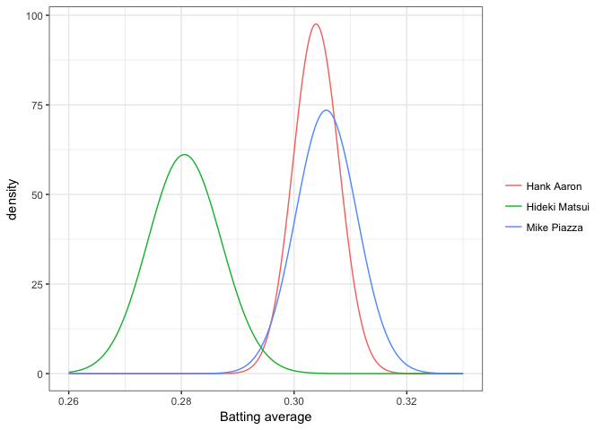
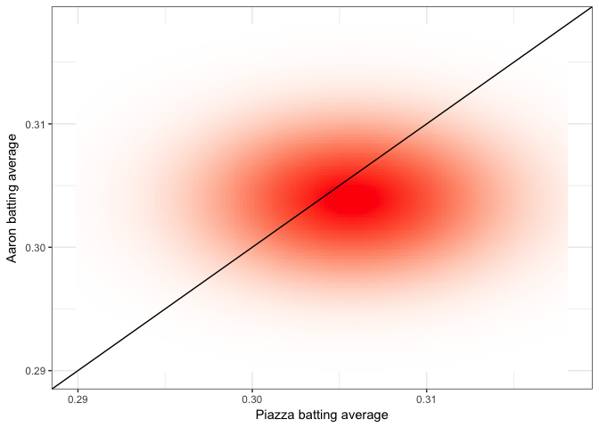
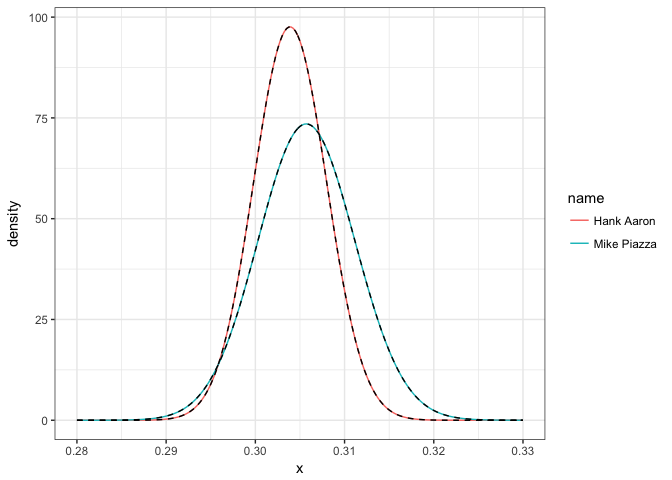

This post and the following posts are a simplification of a series of posts by [David Robinson](http://varianceexplained.org/r/bayesian_ab_baseball/)

- Who is a better batter: Mike Piazza or Hank Aaron?
- Well, Mike Piazza has a slightly higher career batting average (2127 hits / 6911 at-bats = 0.308) than Hank Aaron (3771 hits / 12364 at-bats = 0.305).
- But can we say with confidence that his skill is actually higher, or is it possible he just got lucky a bit more often?

- But we’ve been looking at a single batter at a time
- What if we want to compare two batters, give a probability that one is better than the other, and estimate by how much?
- Understanding the difference between two proportions is important in *A/B testing*

- Here, we’re going to look at an empirical Bayesian approach to comparing two batters
- We’ll define the problem in terms of the difference between each batter’s posterior distribution, and look at four mathematical and computational strategies we can use to resolve this question

## Setup


```r
library(dplyr)
library(tidyr)
library(Lahman)

# Grab career batting average of non-pitchers
# (allow players that have pitched <= 3 games, like Ty Cobb)
pitchers <- Pitching %>%
  group_by(playerID) %>%
  summarize(gamesPitched = sum(G)) %>%
  filter(gamesPitched > 3)

career <- Batting %>%
  filter(AB > 0) %>%
  anti_join(pitchers, by = "playerID") %>%
  group_by(playerID) %>%
  summarize(H = sum(H), AB = sum(AB)) %>%
  mutate(average = H / AB)

# Add player names
career <- Master %>%
  tbl_df() %>%
  select(playerID, nameFirst, nameLast) %>%
  unite(name, nameFirst, nameLast, sep = " ") %>%
  inner_join(career, by = "playerID")

# Estimate hyperparameters alpha0 and beta0 for empirical Bayes
career_filtered <- career %>% filter(AB >= 500)
m <- MASS::fitdistr(career_filtered$average, dbeta,
                    start = list(shape1 = 1, shape2 = 10))

alpha0 <- m$estimate[1]
beta0 <- m$estimate[2]

# For each player, update the beta prior based on the evidence
# to get posterior parameters alpha1 and beta1
career_eb <- career %>%
  mutate(eb_estimate = (H + alpha0) / (AB + alpha0 + beta0)) %>%
  mutate(alpha1 = H + alpha0,
         beta1 = AB - H + beta0) %>%
  arrange(desc(eb_estimate))
```

- So let’s take a look at the two batters in question:


```r
aaron <- career_eb %>% filter(name == "Hank Aaron")
piazza <- career_eb %>% filter(name == "Mike Piazza")
two_players <- bind_rows(aaron, piazza)

two_players
```

```
## # A tibble: 2 x 8
##   playerID  name            H    AB average eb_estimate alpha1 beta1
##   <chr>     <chr>       <int> <int>   <dbl>       <dbl>  <dbl> <dbl>
## 1 aaronha01 Hank Aaron   3771 12364   0.305       0.304   3848  8812
## 2 piazzmi01 Mike Piazza  2127  6911   0.308       0.306   2204  5003
```

- We see that Piazza has a slightly higher average
- But is Piazza’s true probability of getting a hit higher? Or is the difference due to chance?
- To answer, let’s consider the actual posterior distributions- the range of plausible values for their “true” batting averages after we’ve taken the evidence (their batting record) into account. Recall that these posterior distributions are modeled as beta distributions with the parameters $\mbox{Beta}(\alpha_0 + H, \alpha_0 + \beta_0 + H + AB)$


```r
library(broom)
library(ggplot2)
theme_set(theme_bw())

two_players %>%
  inflate(x = seq(.28, .33, .00025)) %>%
  mutate(density = dbeta(x, alpha1, beta1)) %>%
  ggplot(aes(x, density, color = name)) +
  geom_line() +
  labs(x = "Batting average", color = "")
```

```
## Warning: 'inflate' is deprecated.
## Use 'tidyr::crossing' instead.
## See help("Deprecated")
```

<!-- -->

- This posterior is a probabilistic representation of our uncertainty in each estimate
- Thus, when asking the probability Piazza is better, we're asking "if I drew a random draw from Piazza's and a random draw from Aaron's, what's the probability Piazza is higher"?

- Well, notice that those two distributions overlap a lot!
- There's enough uncertainty in each of those estimates that Aaron could easily be better than Piazza.

- Let's throw another player in, retired Yankee Hideki Matsui:

```r
career_eb %>%
  filter(name %in% c("Hank Aaron", "Mike Piazza", "Hideki Matsui")) %>%
  inflate(x = seq(.26, .33, .00025)) %>%
  mutate(density = dbeta(x, alpha1, beta1)) %>%
  ggplot(aes(x, density, color = name)) +
  geom_line() +
  labs(x = "Batting average", color = "")
```

```
## Warning: 'inflate' is deprecated.
## Use 'tidyr::crossing' instead.
## See help("Deprecated")
```

<!-- -->

- Hideki Matsui is a fine batter (above average for major league baseball), but not up to the level of Aaron and Piazza
- Notice that his posterior distribution barely overlaps theirs
- If we took a random draw from Matsui's distribution and from Piazza's, it's very unlikely Matsui's would be higher.

## Posterior Probability

- We may be interested in the probability that Piazza is better than Aaron within our model
- How do we quantify this as a probability
- We’d need to know the probability one beta distribution is greater than another.

- Four routes that are common lines of attack in a Bayesian problem:
  - Simulation of posterior draws
  - Numerical integration
  - Closed-form solution
  - Closed-form approximation

- Which of these approaches you choose depends on your particular problem

### Simulation of posterior draws

- If we don’t want to do any math today, we could simply try simulation.
- We could use each player's $\alpha_1$ and $\beta_1$ parameters, draw a million items from each of them using rbeta, and compare the results


```r
piazza_simulation <- rbeta(1e6, piazza$alpha1, piazza$beta1)
aaron_simulation <- rbeta(1e6, aaron$alpha1, aaron$beta1)

sim <- mean(piazza_simulation > aaron_simulation)
sim
```

```
## [1] 0.606384
```

- So about 60.5% probability Piazza is better than Aaron! 

- Notice we didn’t have to do any mathematical derivation or proofs. 
- This is one of the reasons Bayesian simulation approaches like MCMC have become popular
- Computational power has gotten very cheap, while doing math is as expensive as ever

### Integration

- These two posteriors each have their own (independent) distribution
- Together they form a joint distribution
- That is, a density over particular pairs of xx and yy. That joint distribution could be imagined as a density cloud


```r
library(tidyr)

x <- seq(.29, .318, .0002)
crossing(piazza_x = x, aaron_x = x) %>%
  mutate(piazza_density = dbeta(piazza_x, piazza$alpha1, piazza$beta1),
         aaron_density = dbeta(aaron_x, aaron$alpha1, aaron$beta1),
         joint = piazza_density * aaron_density) %>%
  ggplot(aes(piazza_x, aaron_x, fill = joint)) +
  geom_tile() +
  geom_abline() +
  scale_fill_gradient2(low = "white", high = "red") +
  labs(x = "Piazza batting average",
       y = "Aaron batting average",
       fill = "Joint density") +
  theme(legend.position = "none")
```

<!-- -->

- Here, we’re asking what fraction of the joint probability density lies below that black line, where Piazza’s average is greater than Aaron’s
- Notice that more of it lies below than above: that’s confirming the posterior probability that Piazza is better is about 60%

- The way to calculate this quantitatively is numerical integration

```r
d <- .00002
limits <- seq(.29, .33, d)
sum(outer(limits, limits, function(x, y) {
  (x > y) *
    dbeta(x, piazza$alpha1, piazza$beta1) *
    dbeta(y, aaron$alpha1, aaron$beta1) *
    d ^ 2
}))
```

```
## [1] 0.6055132
```

- Like simulation, this is a bit on the “brute force” side

### Closed-form solution

$$p_A \sim \mbox{Beta}(\alpha_A, \beta_A)$$

$$p_B \sim \mbox{Beta}(\alpha_B, \beta_B)$$

$${\rm Pr}(p_B > p_A) = \sum_{i=0}^{\alpha_B-1}\frac{B(\alpha_A+i,\beta_A+\beta_B)}{(\beta_B+i) B(1+i, \beta_B) B(\alpha_A, \beta_A) }$$

- (Where $B$ is the beta function). If you'd like an intuition behind this formula... well, you're on your own. But it's pretty straightforward to implement in R (I'm borrowing notation from this post and calling it $h$):


```r
h <- function(alpha_a, beta_a,
              alpha_b, beta_b) {
  j <- seq.int(0, round(alpha_b) - 1)
  log_vals <- (lbeta(alpha_a + j, beta_a + beta_b) - log(beta_b + j) -
               lbeta(1 + j, beta_b) - lbeta(alpha_a, beta_a))
  1 - sum(exp(log_vals))
}

h(piazza$alpha1, piazza$beta1,
  aaron$alpha1, aaron$beta1)
```

```
## [1] 0.6052738
```

- Having an exact solution is pretty handy!
- So why did we even look at simulation/integration approaches? Well, the downsides are:
  - Not every problem has a solution like this. And even if it does, we may not know it. That’s why it’s worth knowing how to run a simulation. (If nothing else, they let us check our math!)
  - This solution is slow for large αBαB, and not straightforward to vectorize: notice that term that iterates from 0 to αB−1αB−1. If we run A/B tests with thousands of clicks, this step is going to constrain us (though it’s still usually faster than simulation or integration).
  
### Closed-form approximation

- Notice that when αα and ββ are both fairly large, the beta starts looking a lot like a normal distribution
- So much so that it can be closely approximated


```r
two_players %>%
  mutate(mu = alpha1 / (alpha1 + beta1),
         var = alpha1 * beta1 / ((alpha1 + beta1) ^ 2 * (alpha1 + beta1 + 1))) %>%
  inflate(x = seq(.28, .33, .00025)) %>%
  mutate(density = dbeta(x, alpha1, beta1),
         normal = dnorm(x, mu, sqrt(var))) %>%
  ggplot(aes(x, density, group = name)) +
  geom_line(aes(color = name)) +
  geom_line(lty = 2)
```

```
## Warning: 'inflate' is deprecated.
## Use 'tidyr::crossing' instead.
## See help("Deprecated")
```

<!-- -->

- And the probability one normal is greater than another is very easy to calculate- much easier than the beta!


```r
h_approx <- function(alpha_a, beta_a,
                     alpha_b, beta_b) {
  u1 <- alpha_a / (alpha_a + beta_a)
  u2 <- alpha_b / (alpha_b + beta_b)
  var1 <- alpha_a * beta_a / ((alpha_a + beta_a) ^ 2 * (alpha_a + beta_a + 1))
  var2 <- alpha_b * beta_b / ((alpha_b + beta_b) ^ 2 * (alpha_b + beta_b + 1))
  pnorm(0, u2 - u1, sqrt(var1 + var2))
}

h_approx(piazza$alpha1, piazza$beta1, aaron$alpha1, aaron$beta1)
```

```
## [1] 0.6067882
```

- This calculation is very fast, and (in R terms) it’s vectorizable.

- The disadvantage is that for low αα or low ββ, the normal approximation to the beta is going to fit rather poorly
- While the simulation and integration approaches were inexact, this one will be systematically biased: in some cases it will always give too high an answer, and in some cases too low
- But when we have priors $\alpha_0=r 76.451$ and $\beta_0=r 218.639$, as we do here, our parameters are never going to be low, so we're safe using it.

## Confidence and credible intervals

- In classical (frequentist) statistics, you may have seen this kind of "compare two proportions" problem before, perhaps laid out as a "contingency table"


```r
two_players %>%
  transmute(Player = name, Hits = H, Misses = AB - H) %>%
  knitr::kable()
```


Player         Hits   Misses
------------  -----  -------
Hank Aaron     3771     8593
Mike Piazza    2127     4784

- One of the most common classical ways to approach these contingency table problems is with Pearson's chi-squared test, implemented in R as prop.test


```r
prop.test(two_players$H, two_players$AB)
```

```
## 
## 	2-sample test for equality of proportions with continuity
## 	correction
## 
## data:  two_players$H out of two_players$AB
## X-squared = 0.1476, df = 1, p-value = 0.7008
## alternative hypothesis: two.sided
## 95 percent confidence interval:
##  -0.01645967  0.01091599
## sample estimates:
##    prop 1    prop 2 
## 0.3049984 0.3077702
```

- We see a non-significant p-value of .70
- But we can agree it would have been strange if the p-value were significant, given that the posterior distributions overlapped so much.

- Something else useful that `prop.test` gives you is a confidence interval for the difference between the two players
- We learned in a previous post about credible intervals in terms of each player’s average. Now we’ll use empirical Bayes to compute the credible interval about the difference in these two players


```r
credible_interval_approx <- function(a, b, c, d) {
  u1 <- a / (a + b)
  u2 <- c / (c + d)
  var1 <- a * b / ((a + b) ^ 2 * (a + b + 1))
  var2 <- c * d / ((c + d) ^ 2 * (c + d + 1))
  
  mu_diff <- u2 - u1
  sd_diff <- sqrt(var1 + var2)
  
  data_frame(posterior = pnorm(0, mu_diff, sd_diff),
             estimate = mu_diff,
             conf.low = qnorm(.025, mu_diff, sd_diff),
             conf.high = qnorm(.975, mu_diff, sd_diff))
}

credible_interval_approx(piazza$alpha1, piazza$beta1, aaron$alpha1, aaron$beta1)
```

```
## # A tibble: 1 x 4
##   posterior estimate conf.low conf.high
##       <dbl>    <dbl>    <dbl>     <dbl>
## 1     0.607 -0.00184  -0.0152    0.0115
```

- It’s not particularly exciting for this Piazza/Aaron comparison
- So let’s select 20 random players, and compare each of them to Mike Piazza
- We’ll also calculate the confidence interval using prop.test, and compare them.


```r
set.seed(2016)

intervals <- career_eb %>%
  filter(AB > 10) %>%
  sample_n(20) %>%
  group_by(name, H, AB) %>%
  do(credible_interval_approx(piazza$alpha1, piazza$beta1, .$alpha1, .$beta1)) %>%
  ungroup() %>%
  mutate(name = reorder(paste0(name, " (", H, " / ", AB, ")"), -estimate))
```


```r
f <- function(H, AB) broom::tidy(prop.test(c(H, piazza$H), c(AB, piazza$AB)))
prop_tests <- purrr::map2_df(intervals$H, intervals$AB, f) %>%
  mutate(estimate = estimate1 - estimate2,
         name = intervals$name)
```

```
## Warning in prop.test(c(H, piazza$H), c(AB, piazza$AB)): Chi-squared
## approximation may be incorrect
```

```r
all_intervals <- bind_rows(
  mutate(intervals, type = "Credible"),
  mutate(prop_tests, type = "Confidence")
)

ggplot(all_intervals, aes(x = estimate, y = name, color = type)) +
  geom_point() +
  geom_errorbarh(aes(xmin = conf.low, xmax = conf.high)) +
  xlab("Piazza average - player average") +
  ylab("Player")
```

<!-- -->

- Notice the same pattern we saw in the credible intervals post
- When we don’t have a lot of information about a player, their credible interval ends up smaller than their confidence interval, because we’re able to use the prior to adjust our expectations
- e.g. Andy Wilkins' batting average may be lower than Mike Piazza’s, but we’re confident it’s not .25 lower
- When we do have a lot of information, the credible intervals and confidence intervals converge almost perfectly
- *Thus, we can think of empirical Bayes A/B credible intervals as being a way to “shrink” frequentist confidence intervals, by sharing power across players*

## Bayesian FDR control

- Suppose we were a manager considering trading Piazza for another player (and suppose we could pick anyone from history). How many players in MLB history are we confident are better than Mike Piazza?

- We can compute the posterior probability and credible interval for each of them.


```r
career_eb_vs_piazza <- bind_cols(
  career_eb,
  credible_interval_approx(piazza$alpha1, piazza$beta1,
                           career_eb$alpha1, career_eb$beta1)) %>%
  select(name, posterior, conf.low, conf.high)

career_eb_vs_piazza
```

```
## # A tibble: 10,590 x 4
##    name                             posterior conf.low conf.high
##    <chr>                                <dbl>    <dbl>     <dbl>
##  1 Ty Cobb              0.0000000000000000758  0.0441     0.0716
##  2 Rogers Hornsby       0.0000000000281        0.0345     0.0640
##  3 Shoeless Joe Jackson 0.0000000847           0.0279     0.0613
##  4 Ross Barnes          0.0000366              0.0214     0.0632
##  5 Ed Delahanty         0.000000704            0.0219     0.0518
##  6 Tris Speaker         0.000000157            0.0225     0.0505
##  7 Ted Williams         0.00000145             0.0206     0.0503
##  8 Billy Hamilton       0.00000693             0.0190     0.0503
##  9 Levi Meyerle         0.00407                0.00863    0.0579
## 10 Harry Heilmann       0.00000715             0.0180     0.0476
## # ... with 10,580 more rows
```

- It looks like some do give him a run for his money. For instance, Ty Cobb has a batting average that’s about .04%-.07% better, with only a miniscule posterior probability that we’re wrong.

- In order to get a set of players we’re confident are better (a set of candidates for trading), we can use the same approach to setting a false discovery rate (FDR)
- Taking the cumulative mean of the posterior error probability to compute the q-value.


```r
career_eb_vs_piazza <- career_eb_vs_piazza %>%
  arrange(posterior) %>%
  mutate(qvalue = cummean(posterior))
```

- Recall that the way we find a set of hypotheses with a given false discovery rate (FDR) is by filtering for a particular q-value


```r
better <- career_eb_vs_piazza %>%
  filter(qvalue < .05)

better
```

```
## # A tibble: 63 x 5
##    name                             posterior conf.low conf.high    qvalue
##    <chr>                                <dbl>    <dbl>     <dbl>     <dbl>
##  1 Ty Cobb              0.0000000000000000758   0.0441    0.0716  7.58e⁻¹⁷
##  2 Rogers Hornsby       0.0000000000281         0.0345    0.0640  1.40e⁻¹¹
##  3 Shoeless Joe Jackson 0.0000000847            0.0279    0.0613  2.82e⁻ ⁸
##  4 Tris Speaker         0.000000157             0.0225    0.0505  6.03e⁻ ⁸
##  5 Ed Delahanty         0.000000704             0.0219    0.0518  1.89e⁻ ⁷
##  6 Ted Williams         0.00000145              0.0206    0.0503  3.99e⁻ ⁷
##  7 Willie Keeler        0.00000461              0.0183    0.0473  1.00e⁻ ⁶
##  8 Billy Hamilton       0.00000693              0.0190    0.0503  1.74e⁻ ⁶
##  9 Harry Heilmann       0.00000715              0.0180    0.0476  2.34e⁻ ⁶
## 10 Lou Gehrig           0.0000143               0.0167    0.0461  3.54e⁻ ⁶
## # ... with 53 more rows
```

- This gives us 65 players we can say are better than Piazza, with an FDR of 5%. (That is, we expect we’re wrong on about 5% of this list of players).
