This post and the following posts are a simplification of a series of posts by [David Robinson](http://varianceexplained.org/r/mixture-models-baseball/)


```r
library(knitr)
opts_chunk$set(cache = TRUE, warning = FALSE, message = FALSE)
options(digits = 3)

library(ggplot2)
theme_set(theme_bw())
library(scales)
```

- We've been dealing with a beta distribution with a single peak
- What if we had a multimodal distribution?
- E.g. we filtered out pitchers with a very low batting average than non-pitchers. If they are included the distribution is different
- The batting averages don't look like a single beta distribution any more, but a mixture of beta distributions

- Imagine that you didn’t know which players were pitchers, and you wanted to separate the data into two groups according to your best prediction
- In this post we’ll examine mixture models, where we treat the distribution of batting averages as a mixture of two beta-binomial distributions, and need to guess which player belongs to which group
- This will introduce the concept of expectation-maximisation algorithm

## Setup


```r
library(dplyr)
library(tidyr)
library(Lahman)
library(ggplot2)
theme_set(theme_bw())

# Identify those who have pitched at least three games
pitchers <- Pitching %>%
  group_by(playerID) %>%
  summarize(gamesPitched = sum(G)) %>%
  filter(gamesPitched > 3)

# in this setup, we're keeping some extra information for later in the post:
# a "bats" column and a "year" column
career <- Batting %>%
  filter(AB > 0, lgID == "NL", yearID >= 1980) %>%
  group_by(playerID) %>%
  summarize(H = sum(H), AB = sum(AB), year = mean(yearID)) %>%
  mutate(average = H / AB,
         isPitcher = playerID %in% pitchers$playerID)

# Add player names
career <- Master %>%
  tbl_df() %>%
  dplyr::select(playerID, nameFirst, nameLast, bats) %>%
  unite(name, nameFirst, nameLast, sep = " ") %>%
  inner_join(career, by = "playerID")
```

- Previously we filtered out pitchers, which make the batting averages look roughly like a beta distribution. When they are left in, it looks a lot less like a beta distribution:


```r
fit_bb_mle <- function(x, n) {
  ll <- function(alpha, beta) {
    -sum(VGAM::dbetabinom.ab(x, n, alpha, beta, log = TRUE))
  }
  m <- stats4::mle(ll, start = list(alpha = 30, beta = 100), method = "L-BFGS-B",
           lower = c(0.0001, .1))
  ab <- stats4::coef(m)
  data_frame(alpha = ab[1], beta = ab[2])
}

batting_w_pitchers <- Batting %>%
  filter(AB >= 50, lgID == "NL", yearID > 1985) %>%
  group_by(playerID) %>%
  summarize(H = sum(H), AB = sum(AB), year = mean(yearID)) %>%
  mutate(average = H / AB,
         isPitcher = ifelse(playerID %in% pitchers$playerID, "Pitcher", "Non-Pitcher"),
         isPitcher = relevel(factor(isPitcher), "Pitcher"))

fit <- fit_bb_mle(batting_w_pitchers$H, batting_w_pitchers$AB)

batting_w_pitchers %>%
  ggplot(aes(average, fill = isPitcher)) +
  geom_histogram(bins = 30) +
  stat_function(fun = function(x) 30 * dbeta(x, fit$alpha, fit$beta), lty = 2) +
  xlim(0, .4) +
  labs(fill = "",
       x = "Batting average (H / AB)")
```

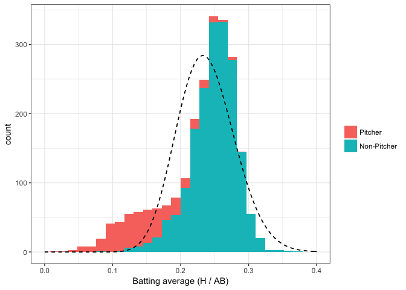<!-- -->

- The dashed density curve represents the beta distribution we would naively fit to this data
- the beta is not a good fit- but that it’s plausible that we could fit the data using two beta distributions, one for pitchers and one for non-pitchers

 ## Expectation-maximization
 
 - The challenge of mixture models is that at the start:
  -  we don’t know which observations belong to which cluster
  -  nor what the parameters of each distribution is
  
- It’s difficult to solve these problems at the same time- so an expectation-maximization (EM) algorithm takes the jump of estimating them one at a time, and alternating between them
- The first thing to do in an EM clustering algorithm is to assign our clusters randomly:


```r
set.seed(2016)

# We'll fit the clusters only with players that have had at least 20 at-bats
starting_data <- career %>%
  filter(AB >= 20) %>%
  dplyr::select(-year, -bats, -isPitcher) %>%
  mutate(cluster = factor(sample(c("A", "B"), n(), replace = TRUE)))
```

```r
starting_data
```

```
## # A tibble: 3,420 x 6
##    playerID  name                   H    AB average cluster
##    <chr>     <chr>              <int> <int>   <dbl> <fct>  
##  1 abbotje01 Jeff Abbott           11    42  0.262  A      
##  2 abbotji01 Jim Abbott             2    21  0.0952 A      
##  3 abbotku01 Kurt Abbott          475  1860  0.255  B      
##  4 abbotky01 Kyle Abbott            3    31  0.0968 A      
##  5 abercre01 Reggie Abercrombie    86   386  0.223  A      
##  6 abnersh01 Shawn Abner          110   531  0.207  A      
##  7 abreubo01 Bobby Abreu         1607  5395  0.298  B      
##  8 abreuto01 Tony Abreu           129   509  0.253  B      
##  9 acevejo01 Jose Acevedo           8   101  0.0792 A      
## 10 aceveju01 Juan Acevedo           6    65  0.0923 A      
## # ... with 3,410 more rows
```


### Maximization

- Now that we've got cluster assignments, what do the densities of each cluster look like?


```r
starting_data %>%
  ggplot(aes(average, color = cluster)) +
  geom_density()
```

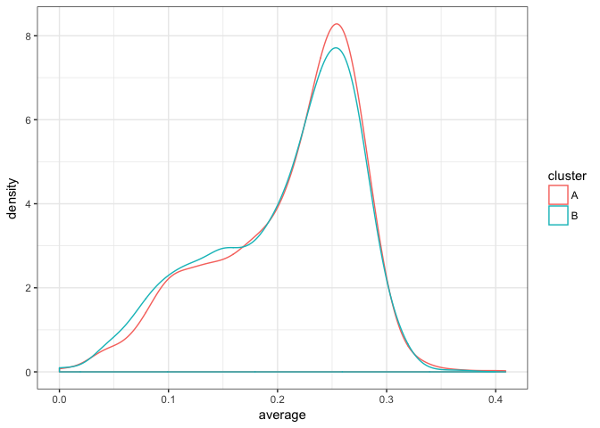<!-- -->

- They have basically the same density
- One of the nice features of expectation-maximization is that we don’t actually have to start with good clusters to end up with a good result

- We’ll now write a function for fitting a beta-binomial distribution using maximum likelihood estimation (and the dbetabinom.ab function from the VGAM package)
- This is a process we’ve done in multiple posts before, just encapsulating it into a function.


```r
library(VGAM)

fit_bb_mle <- function(x, n) {
  # dbetabinom.ab is the likelihood function for a beta-binomial
  # using n, alpha and beta as parameters
  ll <- function(alpha, beta) {
    -sum(dbetabinom.ab(x, n, alpha, beta, log = TRUE))
  }
  m <- stats4::mle(ll, start = list(alpha = 3, beta = 10), method = "L-BFGS-B",
                   lower = c(0.001, .001))
  ab <- stats4::coef(m)
  data_frame(alpha = ab[1], beta = ab[2], number = length(x))
}
```

- here are the alpha and beta chosen for the entire data as a whole


```r
fit_bb_mle(starting_data$H, starting_data$AB)
```

```
## # A tibble: 1 x 3
##   alpha  beta number
##   <dbl> <dbl>  <int>
## 1  12.7  45.1   3420
```

- But now we’re working with a mixture model
- This time, we’re going to fit the model within each of our (randomly assigned) clusters:


```r
fits <- starting_data %>%
  group_by(cluster) %>%
  do(fit_bb_mle(.$H, .$AB)) %>%
  ungroup()

fits
```

```
## # A tibble: 2 x 4
##   cluster alpha  beta number
##   <fct>   <dbl> <dbl>  <int>
## 1 A        13.8  48.4   1651
## 2 B        11.8  42.4   1769
```

- Another component of this model is the prior probability that a player is in cluster A or cluster B, which we set to 50-50 when we were assigning random clusters
We can estimate our new iteration of this based on the total number of assignments in each group, which is why we included the number column:


```r
fits <- fits %>%
  mutate(prior = number / sum(number))

fits
```

```
## # A tibble: 2 x 5
##   cluster alpha  beta number prior
##   <fct>   <dbl> <dbl>  <int> <dbl>
## 1 A        13.8  48.4   1651 0.483
## 2 B        11.8  42.4   1769 0.517
```

- Much as the within-cluster densities only changed a little, the priors only changed a little as well
- This was the maximization step: find the maximum likelihood parameters (in this case, two alpha/beta values, and a per-cluster probability), pretending we knew the assignments.

 ## Expectation
 
 - We now have a distribution for each cluster. It’s worth noting that these are pretty similar distributions, and that neither is a good fit to the data.
 

```r
fits %>%
  crossing(x = seq(0, .4, .0001)) %>%
  mutate(density = dbeta(x, alpha, beta)) %>%
  ggplot() +
  geom_histogram(aes(average, y = ..density.., fill = cluster), data = starting_data, alpha = .2) +
  geom_line(aes(x, density, color = cluster)) +
  ggtitle("")
```

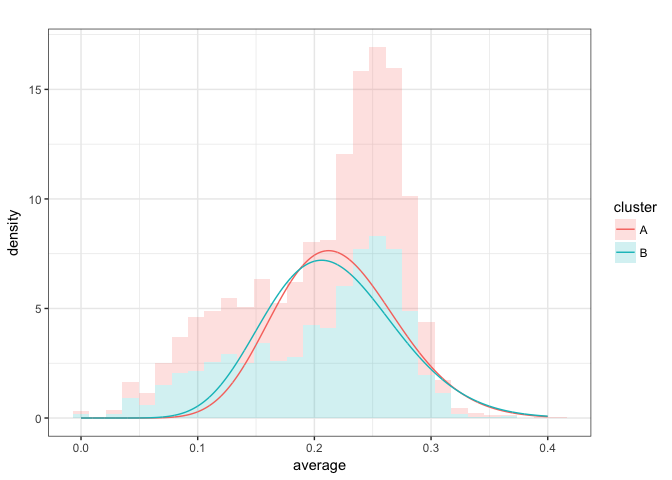<!-- -->

- However, notice that due to a small random difference, cluster A is slightly more likely than cluster B for batting averages above about .2
- vice versa below .2

- Consider therefore that each player has a likelihood it would have been generated from cluster A, and a likelihood it would have been generated from cluster B (being sure to weight each by the prior probability of being in A or B):


```r
crosses <- starting_data %>%
  dplyr::select(-cluster) %>%
  crossing(fits) %>%
  mutate(likelihood = prior * VGAM::dbetabinom.ab(H, AB, alpha, beta))

crosses
```

```
## # A tibble: 6,840 x 11
##    playerID  name         H    AB average cluster alpha  beta number prior
##    <chr>     <chr>    <int> <int>   <dbl> <fct>   <dbl> <dbl>  <int> <dbl>
##  1 abbotje01 Jeff Ab…    11    42  0.262  A        13.8  48.4   1651 0.483
##  2 abbotje01 Jeff Ab…    11    42  0.262  B        11.8  42.4   1769 0.517
##  3 abbotji01 Jim Abb…     2    21  0.0952 A        13.8  48.4   1651 0.483
##  4 abbotji01 Jim Abb…     2    21  0.0952 B        11.8  42.4   1769 0.517
##  5 abbotku01 Kurt Ab…   475  1860  0.255  A        13.8  48.4   1651 0.483
##  6 abbotku01 Kurt Ab…   475  1860  0.255  B        11.8  42.4   1769 0.517
##  7 abbotky01 Kyle Ab…     3    31  0.0968 A        13.8  48.4   1651 0.483
##  8 abbotky01 Kyle Ab…     3    31  0.0968 B        11.8  42.4   1769 0.517
##  9 abercre01 Reggie …    86   386  0.223  A        13.8  48.4   1651 0.483
## 10 abercre01 Reggie …    86   386  0.223  B        11.8  42.4   1769 0.517
## # ... with 6,830 more rows, and 1 more variable: likelihood <dbl>
```

-  consider Jeff Abbott, who got 11 hits out of 42 at-bats. He had a 4.35% chance of getting that if he were in cluster A, but a 4.76% chance if he were in cluster B (based on graph above)
- For that reason (even though it’s a small difference), we’ll put him in B. Similarly we’ll put Kyle Abbott in cluster A: 3/31 was more likely to come from that distribution.

- We can do that for every player using group_by and top_n:


```r
assignments <- starting_data %>%
  dplyr::select(-cluster) %>%
  crossing(fits) %>%
  mutate(likelihood = prior * VGAM::dbetabinom.ab(H, AB, alpha, beta)) %>%
  group_by(playerID) %>%
  top_n(1, likelihood) %>%
  ungroup()

assignments
```

```
## # A tibble: 3,420 x 11
##    playerID  name         H    AB average cluster alpha  beta number prior
##    <chr>     <chr>    <int> <int>   <dbl> <fct>   <dbl> <dbl>  <int> <dbl>
##  1 abbotje01 Jeff Ab…    11    42  0.262  B        11.8  42.4   1769 0.517
##  2 abbotji01 Jim Abb…     2    21  0.0952 B        11.8  42.4   1769 0.517
##  3 abbotku01 Kurt Ab…   475  1860  0.255  A        13.8  48.4   1651 0.483
##  4 abbotky01 Kyle Ab…     3    31  0.0968 B        11.8  42.4   1769 0.517
##  5 abercre01 Reggie …    86   386  0.223  A        13.8  48.4   1651 0.483
##  6 abnersh01 Shawn A…   110   531  0.207  B        11.8  42.4   1769 0.517
##  7 abreubo01 Bobby A…  1607  5395  0.298  B        11.8  42.4   1769 0.517
##  8 abreuto01 Tony Ab…   129   509  0.253  A        13.8  48.4   1651 0.483
##  9 acevejo01 Jose Ac…     8   101  0.0792 B        11.8  42.4   1769 0.517
## 10 aceveju01 Juan Ac…     6    65  0.0923 B        11.8  42.4   1769 0.517
## # ... with 3,410 more rows, and 1 more variable: likelihood <dbl>
```

- That’s the expectation step: *assigning each person to the most likely cluster*. How do our assignments look after that?


```r
ggplot(assignments, aes(average, fill = cluster)) +
  geom_histogram()
```

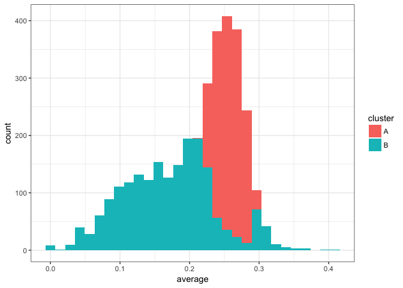<!-- -->

- *Something really important happened here: even though the two beta models we’d fit were very similar, we still split up the data rather neatly*
- Generally batters with a higher average ended up in cluster A, while batters with a lower average were in cluster B
- (Note that due to A having a slightly higher prior probability, it was possible for players with a low average- but also a low AB- to be assigned to cluster A)

## Expectation-Maximization

- The above two steps got to a better set of assignments than our original, random ones.
- But there’s no reason to believe these are as good as we can get
- So we repeat the two steps, choosing new parameters for each distribution in the mixture and then making new assignments each time
- For example, now that we’ve reassigned each player’s cluster, we could re-fit the beta-binomial with the new assignments. Those distributions would look like this:


```r
assignments %>%
  group_by(cluster) %>%
  do(fit_bb_mle(.$H, .$AB)) %>%
  ungroup() %>%
  mutate(prior = number / sum(number)) %>%
  crossing(x = seq(0, .4, .0001)) %>%
  mutate(density = .01 * nrow(assignments) * prior * dbeta(x, alpha, beta)) %>%
  ggplot() +
  geom_histogram(aes(average, fill = cluster), data = assignments, alpha = .25, binwidth = .01) +
  geom_line(aes(x, density, color = cluster))
```

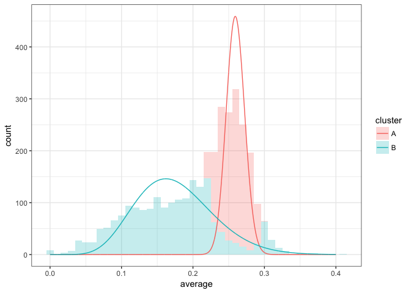<!-- -->

- Unlike our first model fit, we can see that cluster A and cluster B have diverged a lot
- Now we can take those parameters and perform a new estimation step
- Generally we will do this multiple times, as an iterative process
-  This is the heart of an expectation-maximization algorithm, where we switch between assigning clusters (expectation) and fitting the model from those clusters (maximization)


```r
set.seed(1337)

iterate_em <- function(state, ...) {
  fits <- state$assignments %>%
    group_by(cluster) %>%
    do(mutate(fit_bb_mle(.$H, .$AB), number = nrow(.))) %>%
    ungroup() %>%
    mutate(prior = number / sum(number))

  assignments <- assignments %>%
    dplyr::select(playerID:average) %>%
    crossing(fits) %>%
    mutate(likelihood = prior * VGAM::dbetabinom.ab(H, AB, alpha, beta)) %>%
    group_by(playerID) %>%
    top_n(1, likelihood) %>%
    ungroup()
  
  list(assignments = assignments,
       fits = fits)
}

library(purrr)

iterations <- accumulate(1:5, iterate_em, .init = list(assignments = starting_data))
```

- The `accumulate` function from the `purrr` package, which is useful for running data through the same function repeatedly and keeping intermediate states
- I like this approach both because it’s transparent about what we’re doing in each iteration, and because our iterations are now combined in a tidy format, which is convenient to summarize and visualize

- For example, how did our assignments change over the course of the iteration?


```r
assignment_iterations <- iterations %>%
  map_df("assignments", .id = "iteration")

assignment_iterations %>%
  ggplot(aes(average, fill = cluster)) +
  geom_histogram() +
  facet_wrap(~ iteration)
```

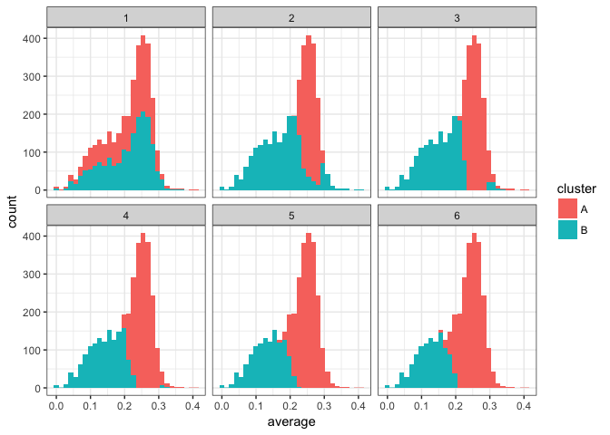<!-- -->

- We notice that only the first few iterations led to a shift in the assignments, after which it appears to converge
- Similarly, how did the estimated beta distributions change over these iterations?


```r
fit_iterations <- iterations %>%
  map_df("fits", .id = "iteration")

fit_iterations %>%
  crossing(x = seq(.001, .4, .001)) %>%
  mutate(density = prior * dbeta(x, alpha, beta)) %>%
  ggplot(aes(x, density, color = iteration, group = iteration)) +
  geom_line() +
  facet_wrap(~ cluster)
```

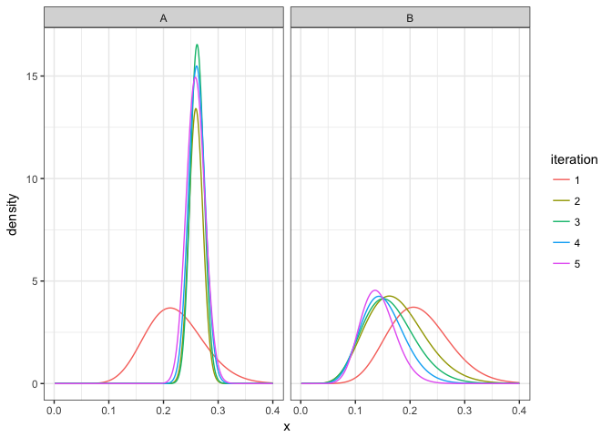<!-- -->

- This confirms that it took about three iterations to converge
- Also notice that in the process, cluster A got much more likely than cluster B, which makes sense since there are more non-pitchers than pitchers in the dataset.

## Assigning players to clusters

- We now have some final parameters for each cluster:


```r
final_parameters <- fit_iterations %>%
  filter(iteration == max(iteration))

final_parameters
```

```
## # A tibble: 2 x 6
##   iteration cluster alpha  beta number prior
##   <chr>     <fct>   <dbl> <dbl>  <int> <dbl>
## 1 5         A       171     489   2184 0.639
## 2 5         B        16.8   101   1236 0.361
```

- How would we assign players to clusters, and get a posterior probability that the player belongs to that cluster?
- Well, let’s arbitrarily pick the six players that each batted exactly 100 times:


```r
batter_100 <- career %>%
  filter(AB == 100) %>%
  arrange(average)

batter_100
```

```
## # A tibble: 5 x 8
##   playerID  name            bats      H    AB  year average isPitcher
##   <chr>     <chr>           <fct> <int> <int> <dbl>   <dbl> <lgl>    
## 1 dejesjo01 Jose de Jesus   R        11   100  1990   0.110 T        
## 2 mahonmi02 Mike Mahoney    R        18   100  2002   0.180 F        
## 3 cancero01 Robinson Cancel R        20   100  2007   0.200 F        
## 4 buschmi01 Mike Busch      R        22   100  1996   0.220 F        
## 5 shealry01 Ryan Shealy     R        32   100  2006   0.320 F
```

- Where would we classify each of them?
- Well, we’d consider the likelihood each would get the number of hits they did if they were a pitcher (cluster B) or a non-pitcher (cluster A):


```r
final_parameters %>%
  crossing(x = 0:45) %>%
  mutate(density = prior * VGAM::dbetabinom.ab(x, 100, alpha, beta)) %>%
  ggplot(aes(x, density)) +
  geom_line(aes(color = cluster)) +
  geom_vline(aes(xintercept = H), data = batter_100, lty = 2) +
  geom_text(aes(x = H, y = -.022, label = name), data = batter_100, hjust = 1, vjust = 1, angle = 270) +
  labs(x = "H (out of 100 at-bats)",
       y = "Likelihood of this H out of 100 hits")
```

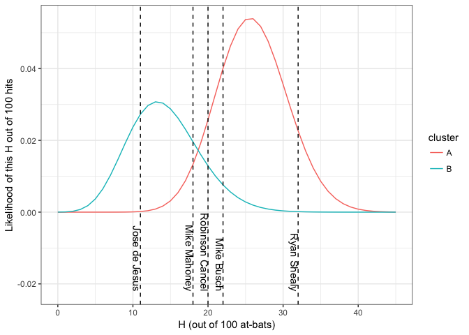<!-- -->

- By Bayes’ Theorem, we can simply use the ratio of one likelihood (say, B in blue) to the sum of the two likelihoods to get the posterior probability:


```r
final_parameters %>%
  crossing(H = 1:40) %>%
  transmute(H, cluster, likelihood = prior * VGAM::dbetabinom.ab(H, 100, alpha, beta)) %>%
  spread(cluster, likelihood) %>%
  mutate(probability_A = A / (A + B)) %>%
  ggplot(aes(H, probability_A)) +
  geom_line() +
  geom_vline(aes(xintercept = H), data = batter_100, lty = 2) +
  geom_text(aes(x = H, y = 0, label = name), data = batter_100, hjust = 1, vjust = 1, angle = 270) +
  labs(x = "H (out of 100 at-bats)",
       y = "(Likelihood if non-pitcher) / (Likelihood if pitcher + Likelihood if not)",
       title = "Posterior probability a player is in the non-pitcher cluster")
```

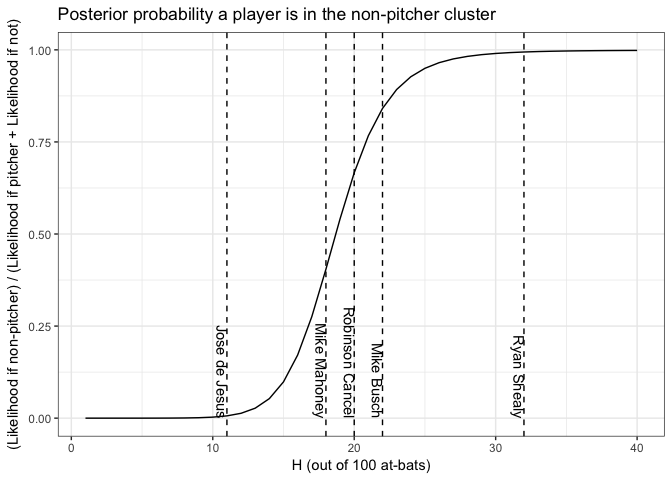<!-- -->

- Based on this, we feel confident that Ryan Shealy are non-pitchers


```r
career_likelihoods <- career %>%
  filter(AB > 20) %>%
  crossing(final_parameters) %>%
  mutate(likelihood = prior * VGAM::dbetabinom.ab(H, AB, alpha, beta)) %>%
  group_by(playerID) %>%
  mutate(posterior = likelihood / sum(likelihood))

career_assignments <- career_likelihoods %>%
  top_n(1, posterior) %>%
  ungroup()
```

- Since we know whether each player actually is a pitcher or not, we can also get a confusion matrix


```r
career_assignments %>%
  filter(posterior > .8) %>%
  count(isPitcher, cluster) %>%
  spread(cluster, n)
```

```
## # A tibble: 2 x 3
##   isPitcher     A     B
## * <lgl>     <int> <int>
## 1 F          1843    71
## 2 T            68   686
```

- Not bad, considering the only information we used was the batting average- and note that we didn’t even use data on who were pitchers to train the model, but just let the clusters define themselves.

## Empirical bayes shrinkage with a mixture model

- Consider the six players who had exactly 100 at-bats. Their posterior distributions would look like this:


```r
batting_data <- career_likelihoods %>%
  ungroup() %>%
  filter(AB == 100) %>%
  mutate(name = paste0(name, " (", H, "/", AB, ")"),
         name = reorder(name, H),
         alpha1 = H + alpha,
         beta1 = AB - H + beta)

batting_data %>%
  crossing(x = seq(0, .4, .001)) %>%
  mutate(posterior_density = posterior * dbeta(x, alpha1, beta1)) %>%
  group_by(name, x) %>%
  summarize(posterior_density = sum(posterior_density)) %>%
  ggplot(aes(x, posterior_density, color = name)) +
  geom_line(show.legend = FALSE) +
  geom_vline(aes(xintercept = average), data = batting_data, lty = 2) +
  facet_wrap(~ name) +
  labs(x = "Batting average (actual average shown as dashed line)",
       y = "Posterior density after updating")
```

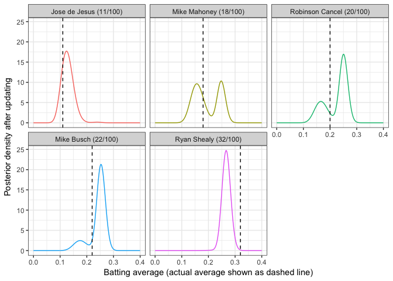<!-- -->

- Pretty sure Jose is in the Pitcher class
- But we are split of Mike Mahoney

- Can we perform shrinkage like we did in that early post?
- If our goal is still to find the mean of each posterior, then yes
- Thanks to linearity of expected value, we can simply average the two distribution means, weighing each by the probability the player belongs to that cluster:


```r
eb_shrinkage <- career_likelihoods %>%
  mutate(shrunken_average = (H + alpha) / (AB + alpha + beta)) %>%
  group_by(playerID) %>%
  summarize(shrunken_average = sum(posterior * shrunken_average))
```

- Jose should get shrunken towards pitcher class centre
- We are quite certain Ryan Shealy is not a pitcher, so he’ll be updated based entirely on that distribution.


```r
eb_shrinkage %>%
  inner_join(career) %>%
  filter(AB > 50) %>%
  gather(type, value, average, shrunken_average) %>%
  mutate(type = ifelse(type == "average", "Raw batting average", "Average posterior"),
         type = relevel(factor(type), "Raw batting average")) %>%
  ggplot(aes(AB, value)) +
  geom_point() +
  facet_wrap(~ type) +
  scale_x_log10() +
  ylab("Estimate")
```

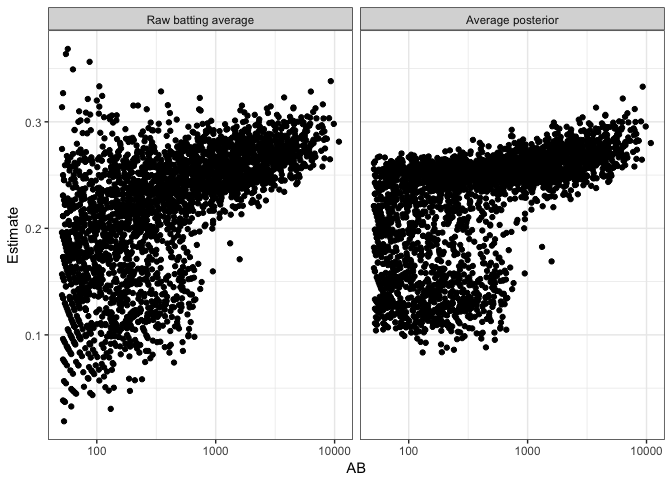<!-- -->

- Notice that instead of shrinking towards a single value, the batting averages are now shrunken towards two centers
- one higher value for the non-pitcher cluster, one smaller value for the pitcher cluster
- Ones that are exactly in between don’t really get shrunken in either direction- they’re “pulled equally"

- Not all of the methods we’ve used in this series are so easy to adapt to a multimodal distribution
- For example, a credible interval is ambiguous in a multimodal distribution (see here for more), and we’d need to rethink our approach to Bayesian A/B testing.
- 
