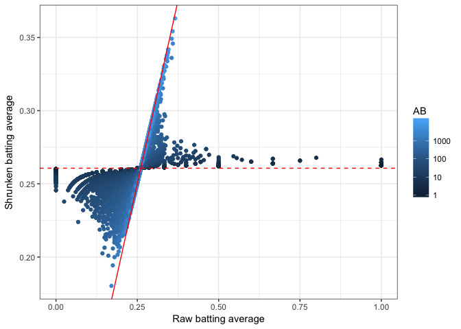
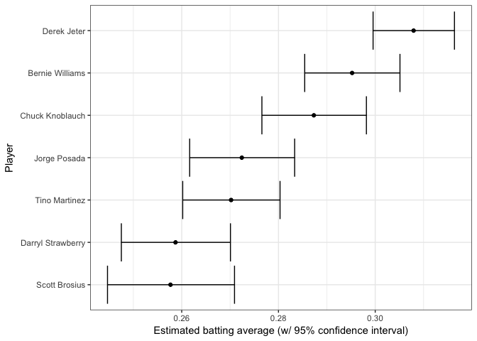
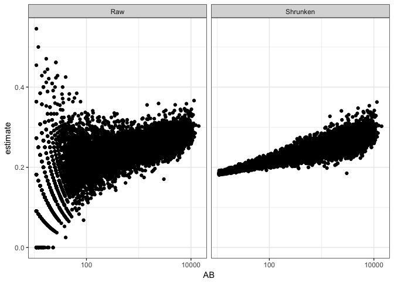
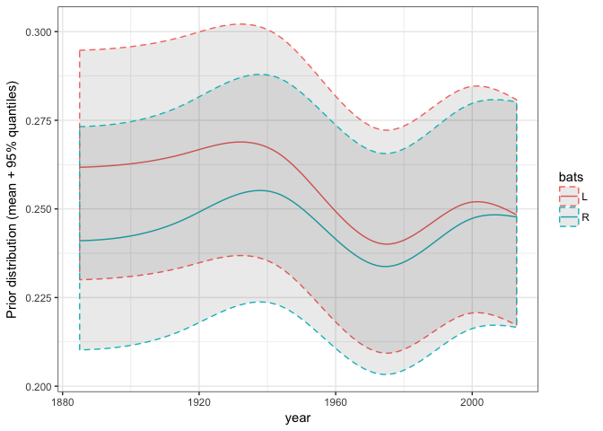
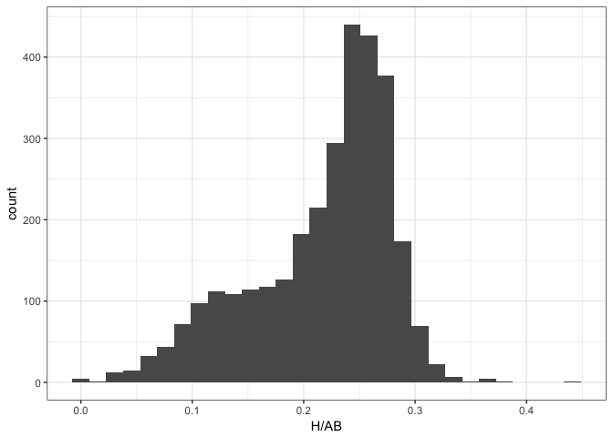
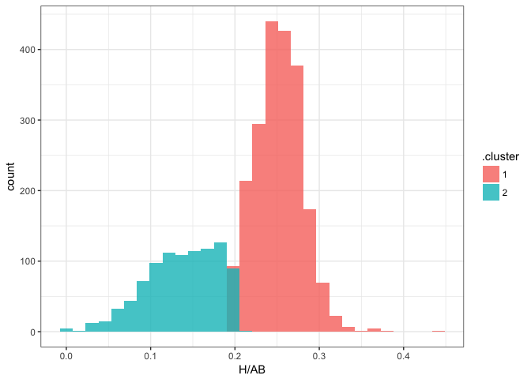
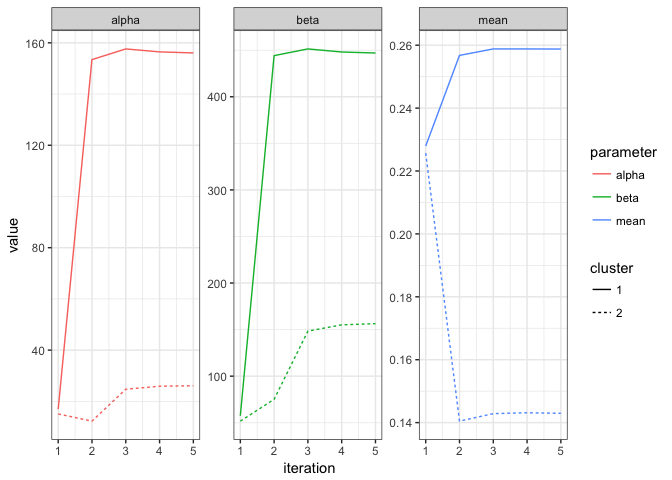
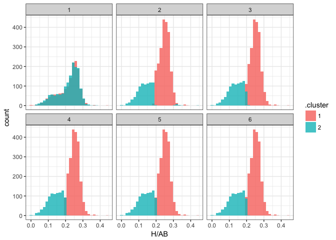

This post and the following posts are a simplification of a series of posts by [David Robinson](http://varianceexplained.org/r/ebbr-package/)


```r
library(knitr)
opts_chunk$set(cache = TRUE, warning = FALSE, message = FALSE)
options(digits = 3)
```

```r
library(ggplot2)
theme_set(theme_bw())
library(scales)
```

Introduction of the new ebbr package for performing empirical Bayes on binomial data.


```r
library(knitr)
opts_chunk$set(message = FALSE, warning = FALSE)

library(scales)
library(ggplot2)
theme_set(theme_bw())
```

## Setup

- Assembling some per-player batting data 
- Using batting averages
- Package can be applied to many types of data


```r
library(Lahman)
library(dplyr)
library(tidyr)

# Grab career batting average of non-pitchers
# (allow players that have pitched <= 3 games, like Ty Cobb)
pitchers <- Pitching %>%
  group_by(playerID) %>%
  summarize(gamesPitched = sum(G)) %>%
  filter(gamesPitched > 3)

# Add player names
player_names <- Master %>%
  tbl_df() %>%
  dplyr::select(playerID, nameFirst, nameLast, bats) %>%
  unite(name, nameFirst, nameLast, sep = " ")

# include the "bats" (handedness) and "year" column for later
career_full <- Batting %>%
  filter(AB > 0) %>%
  anti_join(pitchers, by = "playerID") %>%
  group_by(playerID) %>%
  summarize(H = sum(H), AB = sum(AB), year = mean(yearID)) %>%
  inner_join(player_names, by = "playerID") %>%
  filter(!is.na(bats))

# We don't need all this data for every step
career <- career_full %>%
  select(-bats, -year)
```

## Empirical Bayes estimation

- Player batting averages looks roughly like a beta distribution


```r
career %>%
  filter(AB >= 100) %>%
  ggplot(aes(H / AB)) +
  geom_histogram()
```

<!-- -->

- Consequently, estimated beta prior for the whole dataset (first step in empirical Bayes)
- `ebb_fit_prior` function does this. 
- Takes input as success / total columns and fits the beta through maximum likelihood


```r
# Install the package
devtools::install_github("dgrtwo/ebbr")
```


```r
library(ebbr)

prior <- career %>%
  filter(AB >= 500) %>%
  ebb_fit_prior(H, AB)

prior
```

```
## Empirical Bayes binomial fit with method mle 
## Parameters:
## # A tibble: 1 x 2
##   alpha  beta
##   <dbl> <dbl>
## 1  97.3   276
```

- `prior` is an `ebb_prior` object (statistical model), which contains details on the beta distribution

Next step is to update each observation based on the overall statistical model. Done with `broom` package via the `augment` function:


```r
augment(prior, data = career)
```

```
## # A tibble: 9,756 x 10
##    playerID      H    AB name    .alpha1 .beta1 .fitted   .raw  .low .high
##    <chr>     <int> <int> <chr>     <dbl>  <dbl>   <dbl>  <dbl> <dbl> <dbl>
##  1 aaronha01  3771 12364 Hank A…  3868     8869   0.304 0.305  0.296 0.312
##  2 aaronto01   216   944 Tommie…   313     1004   0.238 0.229  0.215 0.261
##  3 abadan01      2    21 Andy A…    99.3    295   0.252 0.0952 0.210 0.296
##  4 abadijo01    11    49 John A…   108      314   0.256 0.224  0.216 0.299
##  5 abbated01   772  3044 Ed Abb…   869     2548   0.254 0.254  0.240 0.269
##  6 abbeych01   492  1751 Charli…   589     1535   0.277 0.281  0.259 0.297
##  7 abbotda01     1     7 Dan Ab…    98.3    282   0.259 0.143  0.216 0.304
##  8 abbotfr01   107   513 Fred A…   204      682   0.231 0.209  0.203 0.259
##  9 abbotje01   157   596 Jeff A…   254      715   0.262 0.263  0.235 0.291
## 10 abbotku01   523  2044 Kurt A…   620     1797   0.257 0.256  0.239 0.274
## # ... with 9,746 more rows
```

- Additional columns added to the original data (each beginning with a `.`)
- `.alpha1` and `.beta1` columns as parameters for each players posterior distribution
- `.fitted` represents the new posterior mean (the “shrunken average”)

We often run these two steps in sequence:
- estimating the model
- then using it as a prior for each observation
- `ebbr`  package can combine this into one step with `add_ebb_estimate`


```r
eb_career <- career %>%
  add_ebb_estimate(H, AB, prior_subset = AB >= 500)

eb_career
```

```
## # A tibble: 9,756 x 10
##    playerID      H    AB name    .alpha1 .beta1 .fitted   .raw  .low .high
##    <chr>     <int> <int> <chr>     <dbl>  <dbl>   <dbl>  <dbl> <dbl> <dbl>
##  1 aaronha01  3771 12364 Hank A…  3868     8869   0.304 0.305  0.296 0.312
##  2 aaronto01   216   944 Tommie…   313     1004   0.238 0.229  0.215 0.261
##  3 abadan01      2    21 Andy A…    99.3    295   0.252 0.0952 0.210 0.296
##  4 abadijo01    11    49 John A…   108      314   0.256 0.224  0.216 0.299
##  5 abbated01   772  3044 Ed Abb…   869     2548   0.254 0.254  0.240 0.269
##  6 abbeych01   492  1751 Charli…   589     1535   0.277 0.281  0.259 0.297
##  7 abbotda01     1     7 Dan Ab…    98.3    282   0.259 0.143  0.216 0.304
##  8 abbotfr01   107   513 Fred A…   204      682   0.231 0.209  0.203 0.259
##  9 abbotje01   157   596 Jeff A…   254      715   0.262 0.263  0.235 0.291
## 10 abbotku01   523  2044 Kurt A…   620     1797   0.257 0.256  0.239 0.274
## # ... with 9,746 more rows
```

Note the `prior_subset` argument, which noted that while we wanted to keep all the shrunken values in our output, we wanted to fit the prior only on individuals with at least 500 at-bats.

## Estimates and credible intervals

Having posterior estimates we can explore the model results. e.g. we can visualise how the batting averages were shrunken towards the mean of the prior:


```r
eb_career %>%
  ggplot(aes(.raw, .fitted, color = AB)) +
  geom_point() +
  geom_abline(color = "red") +
  scale_color_continuous(trans = "log", breaks = c(1, 10, 100, 1000)) +
  geom_hline(yintercept = tidy(prior)$mean, color = "red", lty = 2) +
  labs(x = "Raw batting average",
       y = "Shrunken batting average")
```

<!-- -->

- empirical Bayes estimation is moving all batting averages towards the prior mean (the dashed red line) 
- Moves them them less if there is a lot of information about that player (high AB).

- Used credible intervals to visualize our uncertainty about each player’s true batting average
- The output of add_ebb_estimate comes with those credible intervals in the form of `.low` and `.high`

With credible intervals already calculated we can easily visualise them:

```r
yankee_1998 <- c("brosisc01", "jeterde01", "knoblch01",
                 "martiti02", "posadjo01", "strawda01", "willibe02")

eb_career %>%
  filter(playerID %in% yankee_1998) %>%
  mutate(name = reorder(name, .fitted)) %>%
  ggplot(aes(.fitted, name)) +
  geom_point() +
  geom_errorbarh(aes(xmin = .low, xmax = .high)) +
  labs(x = "Estimated batting average (w/ 95% confidence interval)",
       y = "Player")
```

<!-- -->

## Hierarchical modeling

We examined in previous posts how this beta-binomial model may not be appropriate, because of the relationship between a player’s at-bats and their batting average. Good batters tend to have long careers, while poor batters may retire quickly.


```r
career %>%
  filter(AB >= 10) %>%
  ggplot(aes(AB, H / AB)) +
  geom_point() +
  geom_smooth(method = "lm") +
  scale_x_log10()
```

<!-- -->

We solved this by fitting a prior that depended on AB, through beta-binomial regression. The `add_ebb_estimate` function offers this option, by setting `method = "gamlss"` and providing a formula to `mu_predictors`.


```r
eb_career_ab <- career %>%
  add_ebb_estimate(H, AB, method = "gamlss",
                    mu_predictors = ~ log10(AB))

eb_career_ab
```

```
## # A tibble: 9,756 x 14
##    playerID      H    AB name    .mu  .sigma .alpha0 .beta0 .alpha1 .beta1
##    <chr>     <int> <int> <chr> <dbl>   <dbl>   <dbl>  <dbl>   <dbl>  <dbl>
##  1 aaronha01  3771 12364 Hank… 0.288 0.00180   160      395    3931   8988
##  2 aaronto01   216   944 Tomm… 0.247 0.00180   137      418     353   1146
##  3 abadan01      2    21 Andy… 0.193 0.00180   107      448     109    467
##  4 abadijo01    11    49 John… 0.204 0.00180   113      442     124    480
##  5 abbated01   772  3044 Ed A… 0.265 0.00180   147      408     919   2680
##  6 abbeych01   492  1751 Char… 0.256 0.00180   142      413     634   1672
##  7 abbotda01     1     7 Dan … 0.180 0.00180    99.7    455     101    461
##  8 abbotfr01   107   513 Fred… 0.238 0.00180   132      423     239    829
##  9 abbotje01   157   596 Jeff… 0.240 0.00180   133      422     290    861
## 10 abbotku01   523  2044 Kurt… 0.259 0.00180   144      411     667   1932
## # ... with 9,746 more rows, and 4 more variables: .fitted <dbl>,
## #   .raw <dbl>, .low <dbl>, .high <dbl>
```

The augmented output is now a bit more complicated: besides the posterior parameters such as `.alpha1`, `.beta1`, and `.fitted`, each observation also has its own prior parameters `.alpha0` and `.beta0`. These are predicted based on the regression on `AB`.

The other parameters, such as `.fitted` and the `credible interval`, are now shrinking towards a trend rather than towards a constant. We can see this by plotting AB against the original and the shrunken estimates:

```r
eb_career_ab %>%
  filter(AB > 10) %>%
  rename(Raw = .raw, Shrunken = .fitted) %>%
  gather(type, estimate, Raw, Shrunken) %>%
  ggplot(aes(AB, estimate)) +
  geom_point() +
  facet_wrap(~ type) +
  scale_x_log10()
```

<!-- -->


The model can incorporate still more useful information e.g.:
- what year they played in
- left- or right-handed


```r
library(splines)

eb_career_prior <- career_full %>%
  ebb_fit_prior(H, AB, method = "gamlss",
                mu_predictors = ~ 0 + ns(year, df = 5) * bats + log(AB))
```

In this case I’m fitting the prior with `ebb_fit_prior` rather than adding the estimates with `add_ebb_estimate`. This lets us feed it new data that we generate ourselves, and examine how the posterior distribution would change. This takes a bit more work, but lets us re-generate one of the more interesting plots from that post about how time and handedness relate:


```r
# fake data ranging from 1885 to 2013
fake_data <- crossing(H = 300,
                      AB = 1000,
                      year = seq(1885, 2013),
                      bats = c("L", "R"))

# find the mean of the prior, as well as the 95% quantiles,
# for each of these combinations. This does require a bit of
# manual manipulation of alpha0 and beta0:
augment(eb_career_prior, newdata = fake_data) %>%
  mutate(prior = .alpha0 / (.alpha0 + .beta0),
         prior.low = qbeta(.025, .alpha0, .beta0),
         prior.high = qbeta(.975, .alpha0, .beta0)) %>%
  ggplot(aes(year, prior, color = bats)) +
  geom_line() +
  geom_ribbon(aes(ymin = prior.low, ymax = prior.high), alpha = .1, lty = 2) +
  ylab("Prior distribution (mean + 95% quantiles)")
```

<!-- -->

## Hypothesis testing

We wanted to get a posterior probability for the statement “this player’s true batting average is greater than .300”, so that we could construct a “Hall of Fame” of such players.

This method is implemented in the add_ebb_prop_test (notice that like `add_ebb_estimate`, it adds columns to existing data). `add_ebb_prop_test` takes the output of an earlier `add_ebb_estimate` operation, which contains posterior parameters for each observation, and appends columns to it:


```r
test_300 <- career %>%
  add_ebb_estimate(H, AB, method = "gamlss", mu_predictors = ~ log10(AB)) %>%
  add_ebb_prop_test(.300, sort = TRUE)

test_300
```

```
## # A tibble: 9,756 x 16
##    playerID      H    AB name    .mu  .sigma .alpha0 .beta0 .alpha1 .beta1
##    <chr>     <int> <int> <chr> <dbl>   <dbl>   <dbl>  <dbl>   <dbl>  <dbl>
##  1 cobbty01   4189 11434 Ty C… 0.287 0.00180     159    396    4348   7641
##  2 hornsro01  2930  8173 Roge… 0.281 0.00180     156    399    3086   5642
##  3 speaktr01  3514 10195 Tris… 0.285 0.00180     158    397    3672   7078
##  4 delahed01  2596  7505 Ed D… 0.280 0.00180     155    400    2751   5309
##  5 willite01  2654  7706 Ted … 0.280 0.00180     156    399    2810   5451
##  6 keelewi01  2932  8591 Will… 0.282 0.00180     157    398    3089   6057
##  7 lajoina01  3242  9589 Nap … 0.284 0.00180     158    397    3400   6744
##  8 jacksjo01  1772  4981 Shoe… 0.273 0.00180     152    403    1924   3612
##  9 gwynnto01  3141  9288 Tony… 0.284 0.00180     157    398    3298   6545
## 10 heilmha01  2660  7787 Harr… 0.281 0.00180     156    399    2816   5526
## # ... with 9,746 more rows, and 6 more variables: .fitted <dbl>,
## #   .raw <dbl>, .low <dbl>, .high <dbl>, .pep <dbl>, .qvalue <dbl>
```

(Note the `sort = TRUE` argument, which sorts in order of our confidence in each player). There are now too many columns to read easily, so we’ll select only a few of the most interesting ones:


```r
test_300 %>%
  select(name, H, AB, .fitted, .low, .high, .pep, .qvalue)
```

```
## # A tibble: 9,756 x 8
##    name                     H    AB .fitted  .low .high      .pep  .qvalue
##    <chr>                <int> <int>   <dbl> <dbl> <dbl>     <dbl>    <dbl>
##  1 Ty Cobb               4189 11434   0.363 0.354 0.371  2.64e⁻⁴⁹ 2.64e⁻⁴⁹
##  2 Rogers Hornsby        2930  8173   0.354 0.344 0.364  2.76e⁻²⁷ 1.38e⁻²⁷
##  3 Tris Speaker          3514 10195   0.342 0.333 0.351  7.30e⁻²¹ 2.43e⁻²¹
##  4 Ed Delahanty          2596  7505   0.341 0.331 0.352  6.09e⁻¹⁶ 1.52e⁻¹⁶
##  5 Ted Williams          2654  7706   0.340 0.330 0.350  1.94e⁻¹⁵ 5.10e⁻¹⁶
##  6 Willie Keeler         2932  8591   0.338 0.328 0.347  3.67e⁻¹⁵ 1.04e⁻¹⁵
##  7 Nap Lajoie            3242  9589   0.335 0.326 0.344  1.08e⁻¹⁴ 2.44e⁻¹⁵
##  8 Shoeless Joe Jackson  1772  4981   0.347 0.335 0.360  1.49e⁻¹⁴ 3.99e⁻¹⁵
##  9 Tony Gwynn            3141  9288   0.335 0.326 0.344  2.80e⁻¹⁴ 6.66e⁻¹⁵
## 10 Harry Heilmann        2660  7787   0.338 0.327 0.348  7.03e⁻¹⁴ 1.30e⁻¹⁴
## # ... with 9,746 more rows
```

Notice that two columns have been added

- `.pep`: the posterior error probability- the probability that this player’s true batting average is less than .3.
- `.qvalue`: the q-value, which corrects for multiple testing by controlling for false discovery rate (FDR). Allowing players with a q-value below .05 would mean only 5% of the ones included would be false 

How many players would be added to our “Hall of Fame” with an FDR of 5%, or 1%:

```r
sum(test_300$.qvalue < .05)
```

```
## [1] 113
```


```r
sum(test_300$.qvalue < .01)
```

```
## [1] 77
```

## Player-player A/B test

We want to compare to another player’s posterior distribution. Similar to the problem of “A/B testing”, where we might be comparing two clickthrough rates, each represented by successes / total.

Compared each player in history to Mike Piazza, and found players we were confident were better batters. We’d first find Piazza’s posterior parameters:


```r
piazza <- eb_career_ab %>%
  filter(name == "Mike Piazza")

piazza_params <- c(piazza$.alpha1, piazza$.beta1)
piazza_params
```

```
## [1] 2282 5184
```

This vector of two parameters, an alpha and a beta, can be passed into add_ebb_prop_test just like we passed in a threshold:


```r
compare_piazza <- eb_career_ab %>%
  add_ebb_prop_test(piazza_params, approx = TRUE, sort = TRUE)
```

Again we select only a few interesting columns:


```r
compare_piazza %>%
  select(name, H, AB, .fitted, .low, .high, .pep, .qvalue)
```

```
## # A tibble: 9,756 x 8
##    name                     H    AB .fitted  .low .high      .pep  .qvalue
##    <chr>                <int> <int>   <dbl> <dbl> <dbl>     <dbl>    <dbl>
##  1 Ty Cobb               4189 11434   0.363 0.354 0.371  6.92e⁻¹⁷ 6.92e⁻¹⁷
##  2 Rogers Hornsby        2930  8173   0.354 0.344 0.364  4.16e⁻¹¹ 2.08e⁻¹¹
##  3 Tris Speaker          3514 10195   0.342 0.333 0.351  1.49e⁻ ⁷ 4.96e⁻ ⁸
##  4 Shoeless Joe Jackson  1772  4981   0.347 0.335 0.360  2.48e⁻ ⁷ 9.92e⁻ ⁸
##  5 Ed Delahanty          2596  7505   0.341 0.331 0.352  9.42e⁻ ⁷ 2.68e⁻ ⁷
##  6 Ted Williams          2654  7706   0.340 0.330 0.350  1.84e⁻ ⁶ 5.31e⁻ ⁷
##  7 Willie Keeler         2932  8591   0.338 0.328 0.347  5.06e⁻ ⁶ 1.18e⁻ ⁶
##  8 Harry Heilmann        2660  7787   0.338 0.327 0.348  8.64e⁻ ⁶ 2.11e⁻ ⁶
##  9 Billy Hamilton        2158  6268   0.339 0.328 0.350  1.10e⁻ ⁵ 3.10e⁻ ⁶
## 10 Nap Lajoie            3242  9589   0.335 0.326 0.344  1.58e⁻ ⁵ 4.37e⁻ ⁶
## # ... with 9,746 more rows
```

Just like the one-sample test, we’ve added `.pep` and `.qvalue` columns. From this we can see a few players who we’re extremely confident are better than Piazza.

## Mixture models

When pitchers are included, the data looks a lot less like a beta distribution and more like a combination of two betas.


```r
career_w_pitchers <- Batting %>%
  filter(AB >= 25, lgID == "NL", yearID >= 1980) %>%
  group_by(playerID) %>%
  summarize(H = sum(H), AB = sum(AB), year = mean(yearID)) %>%
  mutate(isPitcher = playerID %in% pitchers$playerID) %>%
  inner_join(player_names, by = "playerID")
```


```r
ggplot(career_w_pitchers, aes(H / AB)) +
  geom_histogram()
```

<!-- -->

Fitting a mixture model, to separate out the two beta distributions so they could be shrunken separately, took a solid amount of code.

The `ebbr` package thus provides tools for fitting a mixture model using an iterative expectation-maximization algorithm, with the `ebb_fit_mixture` function. Like the other estimation functions, it takes a table as the first argument, followed by two arguments for the “successes” column and the “total” column:


```r
set.seed(2017)
mm <- ebb_fit_mixture(career_w_pitchers, H, AB, clusters = 2)
```

It returns the parameters of two (or more) beta distributions:


```r
tidy(mm)
```

```
## # A tibble: 2 x 6
##   cluster alpha  beta  mean number probability
##   <chr>   <dbl> <dbl> <dbl>  <int>       <dbl>
## 1 1       156     447 0.259   2126       0.500
## 2 2        26.1   156 0.143    949       0.500
```

It also assigns each observation to the most likely cluster. Here, we can see that cluster 2 is made up of pitchers, while cluster 1 is the non-pitchers:


```r
ggplot(mm$assignments, aes(H / AB, fill = .cluster)) +
  geom_histogram(alpha = 0.8, position = "identity")
```

<!-- -->

## Mixture model across iterations

You may be interested in how the mixture model converged to its parameters. The `iterations` component of the `ebb_mixture` object contains details on the iterations, which can be visualized.


```r
fits <- mm$iterations$fits

fits
```

```
## # A tibble: 10 x 7
##    iteration cluster alpha  beta  mean number probability
##        <int> <chr>   <dbl> <dbl> <dbl>  <int>       <dbl>
##  1         1 2        15.1  51.7 0.226   1553       0.500
##  2         1 1        17.0  57.4 0.228   1522       0.500
##  3         2 1       153   444   0.257   2208       0.500
##  4         2 2        12.3  75.1 0.140    867       0.500
##  5         3 1       158   451   0.259   2142       0.500
##  6         3 2        24.7 148   0.143    933       0.500
##  7         4 1       156   448   0.259   2124       0.500
##  8         4 2        25.9 155   0.143    951       0.500
##  9         5 1       156   447   0.259   2126       0.500
## 10         5 2        26.1 156   0.143    949       0.500
```


```r
fits %>%
  gather(parameter, value, alpha, beta, mean) %>%
  ggplot(aes(iteration, value, color = parameter, lty = cluster)) +
  geom_line() +
  facet_wrap(~ parameter, scales = "free_y")
```

<!-- -->

Note that it took only about one full iteration for the parameters to get pretty close to their eventual values. We can also examine the change in cluster assignments for each observation:


```r
assignments <- mm$iterations$assignments

assignments
```

```
## # A tibble: 18,450 x 10
##    iteration playerID      H    AB  year isPitcher name     bats  .cluster
##        <int> <chr>     <int> <int> <dbl> <lgl>     <chr>    <fct> <chr>   
##  1         1 abbotje01    11    42  2001 F         Jeff Ab… R     2       
##  2         1 abbotku01   473  1851  1997 F         Kurt Ab… R     2       
##  3         1 abbotky01     2    29  1992 T         Kyle Ab… L     1       
##  4         1 abercre01    86   386  2007 F         Reggie … R     1       
##  5         1 abnersh01   110   531  1989 F         Shawn A… R     2       
##  6         1 abreubo01  1602  5373  2003 F         Bobby A… L     2       
##  7         1 abreuto01   127   497  2010 F         Tony Ab… B     1       
##  8         1 acevejo01     6    77  2002 T         Jose Ac… R     1       
##  9         1 ackerji01     3    28  1986 T         Jim Ack… R     1       
## 10         1 adamecr01    62   278  2016 F         Cristhi… B     1       
## # ... with 18,440 more rows, and 1 more variable: .likelihood <dbl>
```


```r
assignments %>%
  ggplot(aes(H / AB, fill = .cluster)) +
  geom_histogram(alpha = 0.8, position = "identity") +
  facet_wrap(~ iteration)
```

<!-- -->

