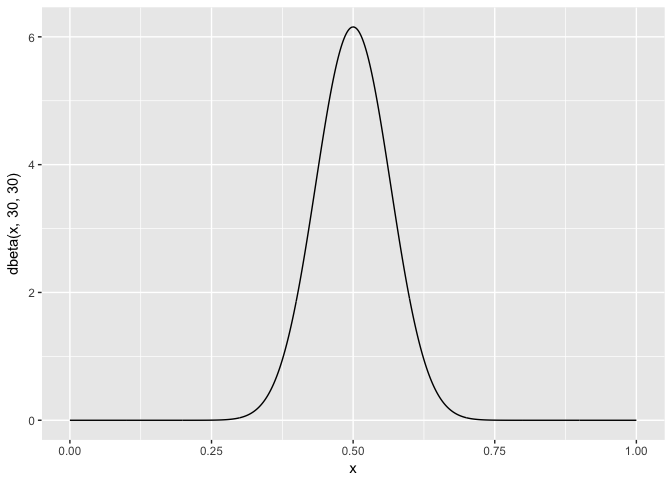
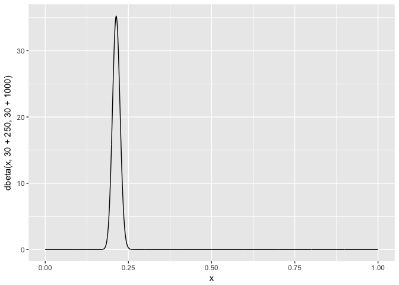
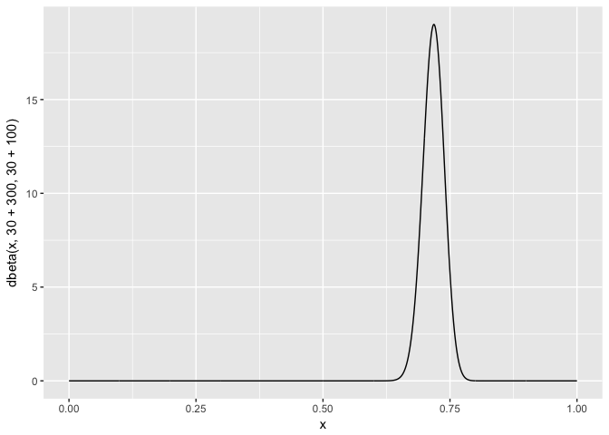

```r
library(ggplot2)
```

Say you want to measure if a change to a button on website increases the number of clicks the button receives. You have data on the old button where the collected data contains the number of times a user has seen the button and the number of times the user has clicked the button. You can then calculate the click rate by dividing the number of clicks by the number of times the button was seen for all users. You can then plot this distribution, with this distribution a beta distribution can be fitted. Say you have done all of this and you get the following beta distribution:


```r
x <- seq(0, 1, length=1000)
ggplot(mapping=aes(x=x,y=dbeta(x, 30, 30))) + geom_line()
```

<!-- -->

Looks like our beta distribution for the old button in centred around 0.5 meaning the most likely probability that a user will click the old button is 50%.

Now we start collecting data on the new button and start to update the beta distribution like so:

* new alpha: old alpha + total new button clicks
* new beta: old beta + total new button seen (but not clicked)

Say the values for the new variables are:

* total new button clicks: 250
* total new button seen (but not clicked): 1000

The new beta distribution would be:

* alpha: 30 + 250
* beta: 30 + 1000

This plotted looks like:

```r
ggplot(mapping=aes(x=x,y=dbeta(x, 30+250, 30+1000))) + geom_line()
```

<!-- -->

Wow, looks like the new button had a negative impact, with the peak centred around 0.2 meaning that there is a 20% chance a user will click the new button, we should defiantly revert back to the old button. Notice also how the peak is narrower compared to the old button peak, this due to an increased amount of evidence.

Say we change the button again and get the following results: 
The new beta distribution would be:

* total new button clicks: 300
* total new button seen (but not clicked): 100

Let’s update the beta distribution again this time with these values:

```r
ggplot(mapping=aes(x=x,y=dbeta(x, 30+300, 30+100))) + geom_line()
```

<!-- -->

Looks like this button performed much better with ~70% chance that user will click the button.

### Note
This is a very contrived a simplified example of how to update the beta distribution. In the wild there are many more things to consider.
